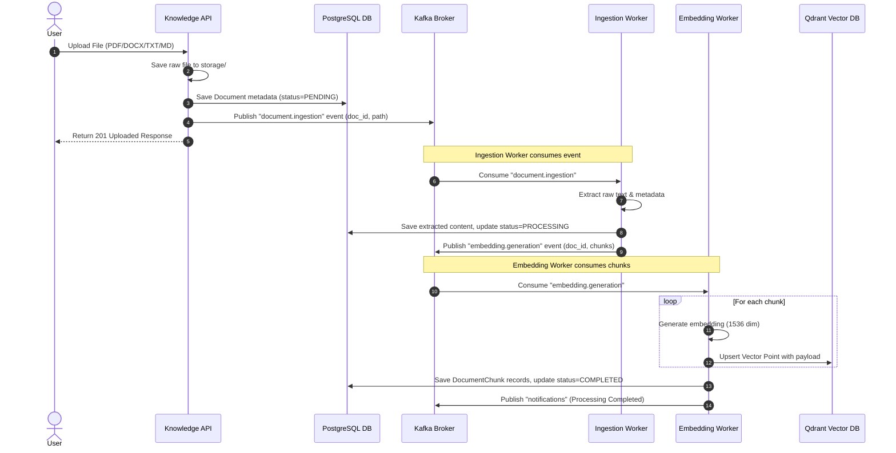
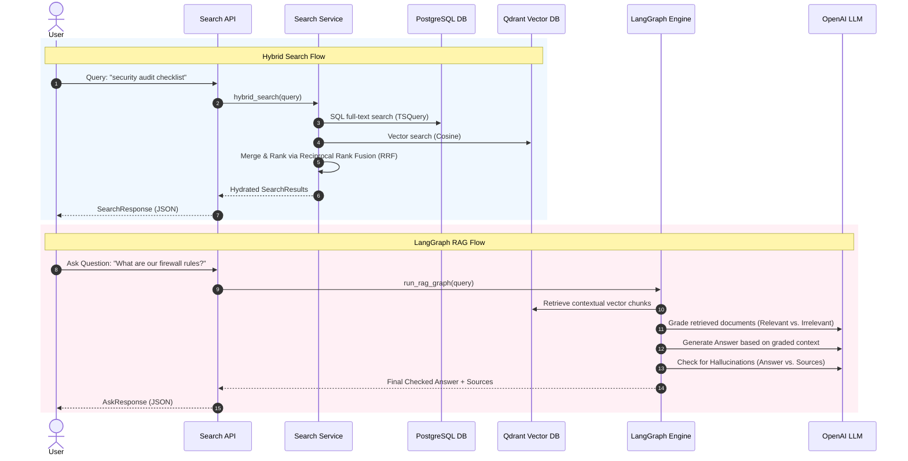

# System Architecture Guide

The Enterprise Knowledge Hub is an AI-powered, document-based knowledge sharing and discovery platform. It combines traditional structured metadata management (PostgreSQL) with advanced unstructured semantic search (Qdrant), a distributed message broker (Kafka), caching/rate-limiting (Redis), and an advanced LLM agent workflow (LangGraph).

---

## 1. System Overview & Services

The platform follows a microservices-aligned, modular monolithic architecture built in Python (FastAPI). The components work in concert as described below:

```
┌────────────────────────────────────────────────────────────────────────┐
│                        API Gateway / FastAPI Router                    │
└────────────────────────────────────────────────────────────────────────┘
       │                │                │               │          │
┌──────▼──────┐  ┌──────▼──────┐  ┌──────▼──────┐  ┌─────▼─────┐  ┌─▼──┐
│    Auth     │  │  Knowledge  │  │   Search    │  │    AI     │  │Anal│
│   Service   │  │   Service   │  │   Service   │  │  (RAG)    │  │ytic│
└──────┬──────┘  └──────┬──────┘  └──────┬──────┘  └─────┬─────┘  └─┬──┘
       │                │                │               │          │
┌──────▼────────────────▼────────────────▼───────────────▼──────────▼─────┐
│                          PostgreSQL Database                           │
└────────────────────────────────────────────────────────────────────────┘
```

### Core Services

*   **API Gateway / FastAPI Router**: Handles CORS middleware, rate limiting, request validation, routing, and maps endpoints to respective services.
*   **Authentication & Auth Service**: Implements OAuth2 with password hashing (bcrypt) and signed JWT tokens (access + refresh token pair). It handles RBAC validation (Roles and Permissions associations in PostgreSQL) and blacklists logged-out tokens in Redis.
*   **Knowledge Service**: Manages document uploads, project relationships, and metadata CRUD. Coordinates local file storage writes, DB transactions, and publishes events to Kafka to kick off text extraction.
*   **Ingestion Service (Workers)**: Listens to the `document.ingestion` topic. Extracts text from raw PDF, DOCX, TXT, and Markdown files. Sends the raw content to the **DocumentChunker** to split text recursively into small, overlapping snippets.
*   **Embedding & Vector Generation Worker**: Consumes text chunks from the `embedding.generation` topic, calls the OpenAI Embeddings API (`text-embedding-ada-002`, 1536 dimensions), and upserts vector representations into **Qdrant**.
*   **Search Service**: Performs hybrid search (combining PostgreSQL full-text/keyword search with Qdrant vector semantic search using Reciprocal Rank Fusion - RRF) to yield highly relevant contextual snippets.
*   **AI (RAG with LangGraph) Service**: Executes a multi-stage LangGraph state machine. It retrieves document chunks, filters out irrelevant content (Retrieval Grader), refines the query or answers the question using GPT-4, and performs hallucination checks against the retrieved sources before returning the final answer.
*   **Analytics Service**: Collects user interactions (searches, queries, document views) asynchronously via Kafka and stores them in PostgreSQL to render performance and usage dashboards.
*   **Notification Service**: Sends instant notifications when document processing completes or when projects update, decoupled via Kafka's `notifications` topic.

---

## 2. Ingestion, Search, and RAG Data Flows

### A. Document Ingestion Pipeline
When a user uploads a document, it is saved, registered in the DB, and processed asynchronously.



### B. Hybrid Search & RAG Flow
How semantic search and LLM-based answering work.



---

## 3. Vector Database Layout (Qdrant)

The vector database is managed using **Qdrant Cloud** (or local Qdrant instance). We configure a single main collection for document chunk search.

### Collection Setup
*   **Collection Name**: `knowledge_embeddings`
*   **Vector Configuration**:
    *   `size`: 1536 (OpenAI `text-embedding-ada-002` dimensions)
    *   `distance`: `Cosine` (Normalized dot product for text similarity)
    *   `on_disk`: `false` (Kept in memory for ultra-fast latency; set to `true` in production payload/index adjustments)

### Point Payload Schema
Each vector point stored in Qdrant contains the following JSON payload:

```json
{
  "document_id": "8a3d6b05-c99b-4654-a957-3f32de390c2e",
  "chunk_id": "4efb1e7c-cfd5-45d6-b188-75c1a84f323a",
  "project_id": "f8c5b364-e1b9-4be6-a4f6-7b47b85bbd82",
  "department_id": "3c5123d2-28df-469b-8d14-8fcdfb48df74",
  "text": "This paragraph describes the secure firewall configuration for the cloud environment. Only ports 80, 443, and 22 are open...",
  "file_type": "PDF"
}
```

### Payload Filtering and Indexes
To enable fast sub-second querying constrained by access privileges, we establish **Payload Field Indexes** in Qdrant on:
1.  `project_id` (Keyword index): Restricts queries to current project scope.
2.  `department_id` (Keyword index): Enables department-level knowledge sharing boundaries.
3.  `file_type` (Keyword index): Filters search by file type.

Filtering criteria are applied in the search payload as `Filter` with `must` conditions:
```python
Filter(
    must=[
        FieldCondition(key="project_id", match=MatchValue(value="f8c5b364...")),
        FieldCondition(key="department_id", match=MatchValue(value="3c5123d2..."))
    ]
)
```

---

## 4. Kafka Event Broker Schema

Distributed asynchronous events decouple compute-intensive document extraction, vector generation, and telemetry gathering.

### Topic: `document.ingestion`
*   **Description**: Fired by the API when a file is successfully saved to disk.
*   **Payload Schema**:
```json
{
  "document_id": "8a3d6b05-c99b-4654-a957-3f32de390c2e",
  "file_path": "/storage/documents/8a3d6b05-c99b-4654-a957-3f32de390c2e_manual.pdf",
  "file_type": "PDF",
  "owner_id": "c1f10ea8-4cf5-4a5f-9e7f-712e06ad9d2f"
}
```

### Topic: `embedding.generation`
*   **Description**: Fired by the Ingestion worker when text extraction is completed, containing extracted chunk objects to embed.
*   **Payload Schema**:
```json
{
  "document_id": "8a3d6b05-c99b-4654-a957-3f32de390c2e",
  "chunks": [
    {
      "chunk_id": "4efb1e7c-cfd5-45d6-b188-75c1a84f323a",
      "text": "Section 1. Security baseline configurations for...",
      "index": 0
    },
    {
      "chunk_id": "2db4e81a-7b3c-44bf-80a5-f7253b754ea2",
      "text": "Section 2. Database network isolation details...",
      "index": 1
    }
  ]
}
```

### Topic: `notifications`
*   **Description**: Broadcasts real-time events for websocket pushing or dispatching emails.
*   **Payload Schema**:
```json
{
  "id": "e9c1248c-bfd3-4903-8d6f-9988ff88ff88",
  "user_id": "c1f10ea8-4cf5-4a5f-9e7f-712e06ad9d2f",
  "title": "Document Processed Successfully",
  "message": "Your document 'manual.pdf' is now indexed and searchable.",
  "type": "info",
  "metadata": {
    "document_id": "8a3d6b05-c99b-4654-a957-3f32de390c2e"
  }
}
```

### Topic: `analytics.events`
*   **Description**: Tracks user actions to update stats, trending topics, and telemetry.
*   **Payload Schema**:
```json
{
  "user_id": "c1f10ea8-4cf5-4a5f-9e7f-712e06ad9d2f",
  "event_type": "search",
  "timestamp": "2026-06-20T12:07:39Z",
  "metadata": {
    "query": "Kubernetes migration",
    "search_type": "hybrid",
    "took_ms": 142.5,
    "results_count": 8
  }
}
```

---

## 5. Relational Database Design (PostgreSQL)

We use SQLAlchemy ORM. The relational model enforces referential integrity, supports full-text search vector indexes, and records audit logs.

### Key DB Tables & Columns

1.  **`users`**: User identity accounts.
    *   Unique index on `email`.
    *   Unique index on `username`.
    *   Foreign Key on `department_id` referencing `departments(id) ON DELETE SET NULL`.
2.  **`roles`** & **`permissions`**: RBAC configurations.
    *   Many-to-Many association tables `user_roles` and `role_permissions` with foreign key constraints.
3.  **`documents`**: Document files and metadata.
    *   Foreign Key on `owner_id` referencing `users(id) ON DELETE CASCADE`.
    *   Index on `status` (PENDING, PROCESSING, COMPLETED, FAILED) for dashboard metrics.
    *   Full-text search index (`tsvector` column or GIN index mapping the document text/title for keyword search).
4.  **`document_chunks`**: Maps individual text chunks.
    *   Foreign Key on `document_id` referencing `documents(id) ON DELETE CASCADE`.
5.  **`experts`**: Cached user expertise profiles.
    *   Foreign Key on `user_id` referencing `users(id) ON DELETE CASCADE`.
    *   Array column `topics` containing lower-case keyword strings.

### Constraints & Indexes
*   **Cascading Deletes**: `ON DELETE CASCADE` is set on `document_chunks` and `user_roles` to prevent orphaned child rows.
*   **Full-Text Search Index**:
    ```sql
    CREATE INDEX document_search_idx ON documents USING gin(to_tsvector('english', title || ' ' || coalesce(content, '')));
    ```
*   **Expert Array Index**:
    ```sql
    CREATE INDEX experts_topics_idx ON experts USING gin(topics);
    ```

---

## 6. Caching & Session Architecture (Redis)

Redis is deployed as a high-performance in-memory cache and state manager.

```
                  ┌──────────────────────┐
                  │      API Client      │
                  └──────────┬───────────┘
                             │
            ┌────────────────▼────────────────┐
            │       FastAPI Middleware        │
            └────────┬────────────────┬───────┘
                     │ Check          │ Increment
                     │ Blacklist      │ Counters
            ┌────────▼────────┐     ┌─▼──────────────┐
            │ Redis Blacklist │     │ Redis Rate Lmt │
            └─────────────────┘     └────────────────┘
```

### Redis Key Schemas

1.  **Auth Token Blacklist**:
    *   **Purpose**: Neutralizes JWT access and refresh tokens on logout or security rotation.
    *   **Key Pattern**: `blacklist:{token}`
    *   **Value**: `"true"`
    *   **TTL**: Dynamically set to the token's remaining time-to-live (`exp` claim minus current timestamp).
2.  **API Rate Limiting Counters**:
    *   **Purpose**: Protects endpoints against brute-force or abuse.
    *   **Key Pattern**: `rate_limit:{user_id_or_ip}:{minute_timestamp}`
    *   **Value**: Integer count.
    *   **TTL**: 60 seconds.
3.  **Dashboard Analytics Cache**:
    *   **Purpose**: Speeds up database-intensive metrics collection.
    *   **Key Pattern**: `analytics:dashboard_stats`
    *   **Value**: JSON string of computed metrics.
    *   **TTL**: 300 seconds (5 minutes).
